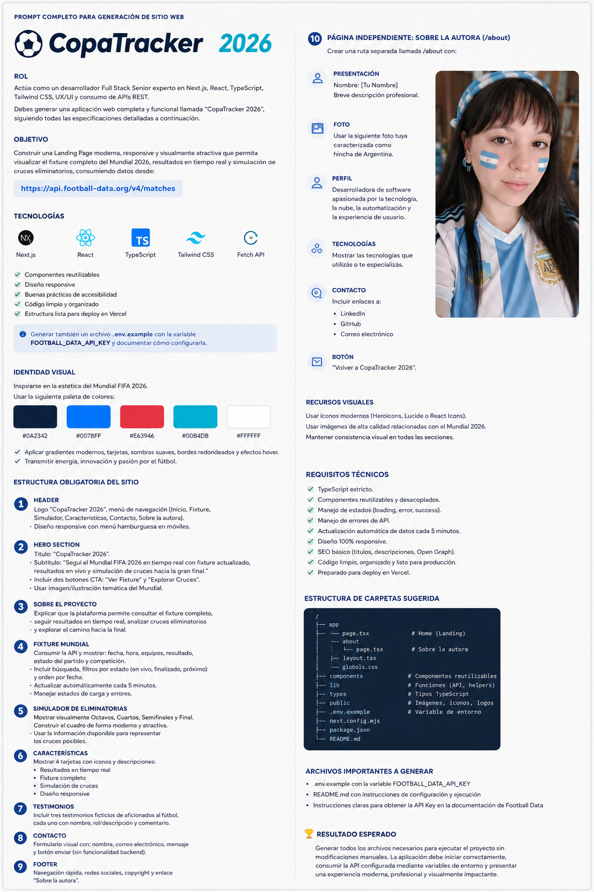
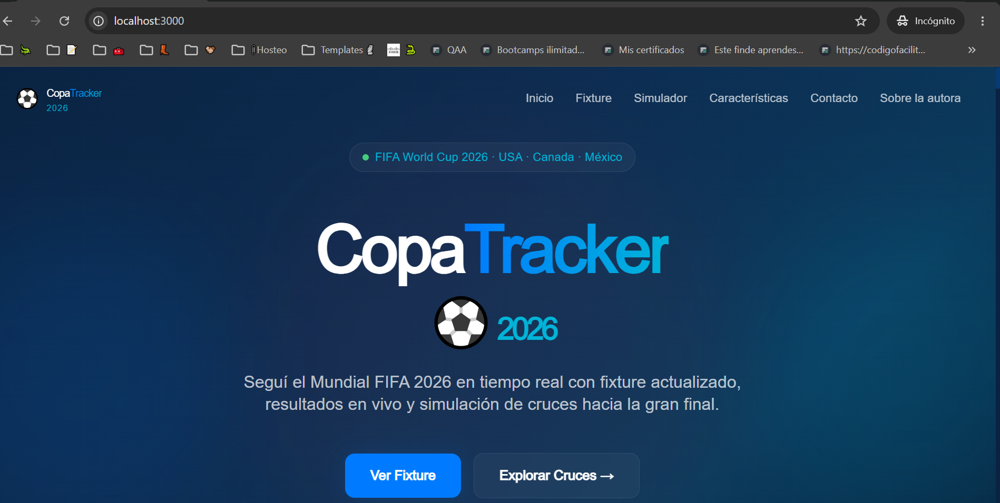
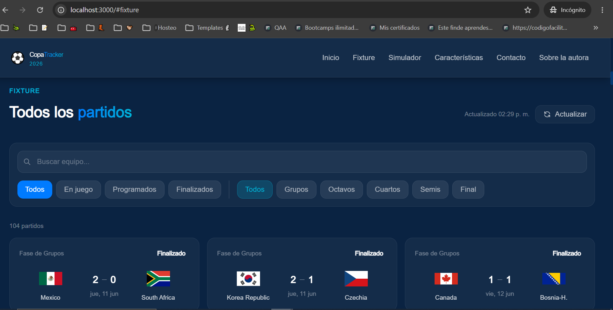
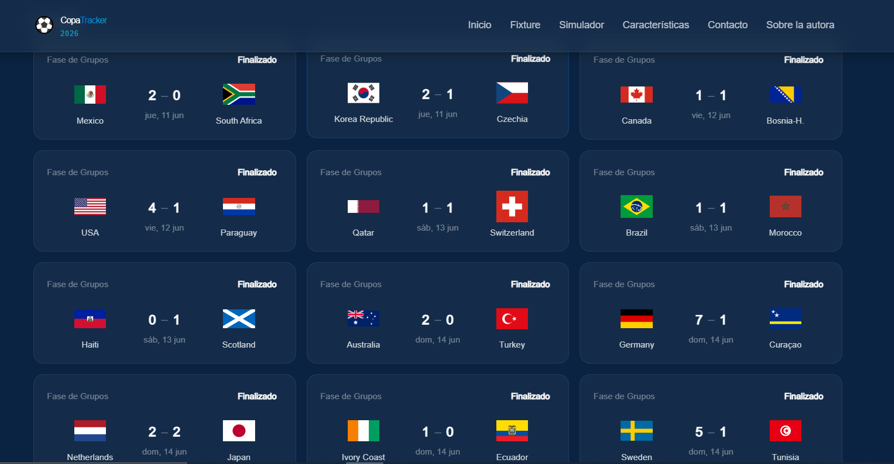
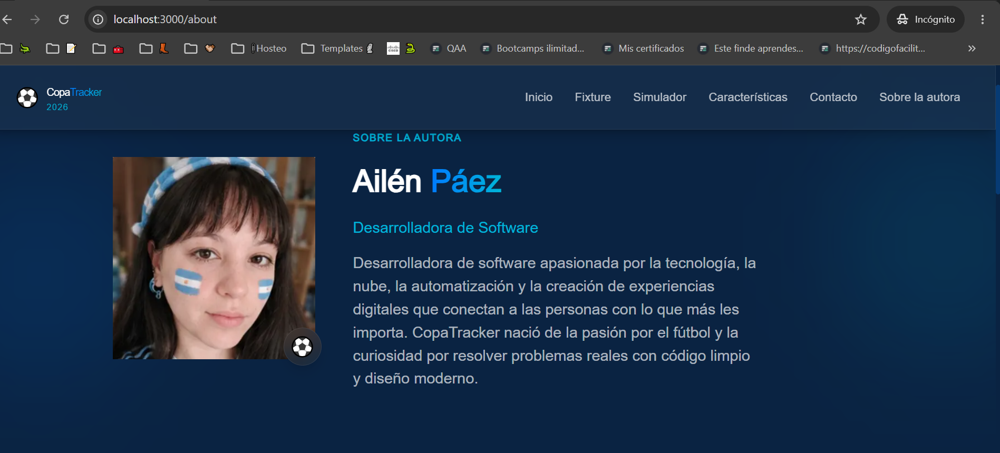
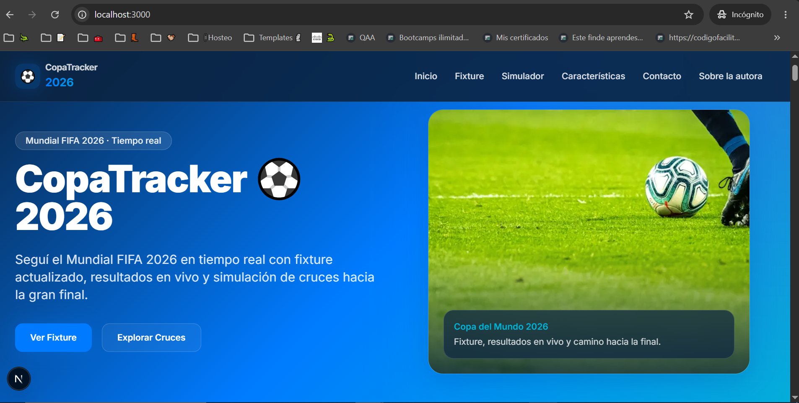
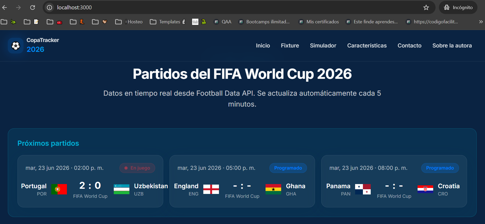
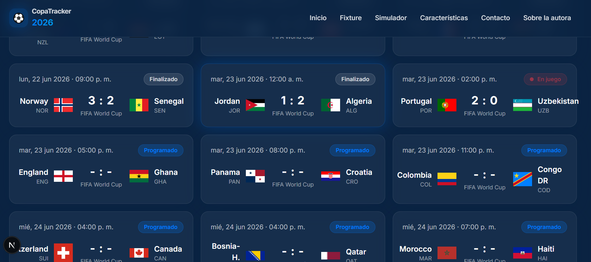
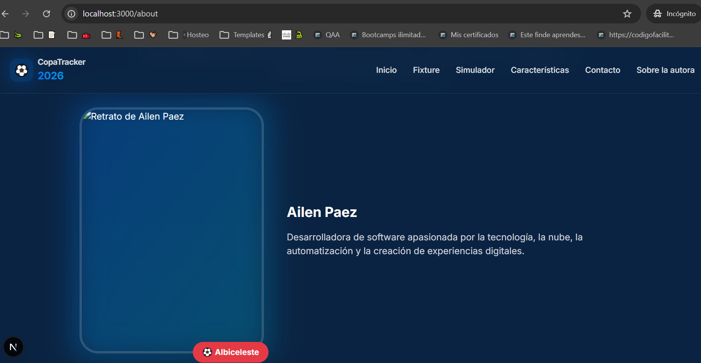

# PFO Individual 2  - AGENTES IA

### Nombre del proyecto: CopaTracker ⚽ 2026
---
- **Link deploy unificado**: https://pfo-2-paez-agentes-menu.vercel.app/
- **Alumna**: Ailén Páez
- **Comisión**: Viernes - 2E
- **Materia**: Frontend
- **Año**:2026

---
### Descripción del proyecto

CopaTracker ⚽ 2026 es una aplicación web desarrollada mediante agentes de Inteligencia Artificial utilizando un único prompt.

La plataforma permite seguir el Mundial FIFA 2026 mediante:

- Fixture completo.
- Próximos partidos.
- Resultados actualizados.
- Estados de los encuentros.
- Simulación visual de cruces eliminatorios.
- Información del proyecto.
- Página de presentación de la autora.

El objetivo principal de esta práctica fue evaluar la capacidad de distintos agentes de desarrollo para generar una aplicación completa de forma autónoma a partir de un mismo conjunto de instrucciones.

---

### Planificación previa

Antes de la generación del proyecto se elaboraron dos briefs con el objetivo de definir la estructura, alcance y requisitos funcionales de la aplicación.

Estos documentos permitieron:

- Definir los objetivos del proyecto.
- Establecer la identidad visual.
- Determinar las funcionalidades principales.
- Organizar la arquitectura de la interfaz.
- Identificar las tecnologías requeridas.
- Estructurar el prompt final utilizado por los agentes de IA.

*La información obtenida a partir de ambos briefs fue utilizada como base para construir el prompt definitivo en:*

- Claude Code
- Cursor

*Esta etapa resultó buena para mejorar la precisión de las instrucciones y reducir la necesidad de iteraciones durante la generación del proyecto.*



**⚠ ADVERTENCIA: En el proyecto se usa un token para poder consumir la api, está comentada en el documento de entrega.**

---

### 🤖 Agentes utilizados

|  | Agente 1 | Agente 2 |
| --- | --- | --- |
| Herramienta | Claude Code | Cursor + Github Copilot |
| Modelo | Claude Sonnet | Composter 2.5 Fast |

---

<h2 align="center">Tecnologías Utilizadas</h2>

<p align="center">
  
</p>

<p align="center">
  
  
  
  
</p>

---

### Instalación

Clonar el repositorio:

```
git clone https://github.com/ailenpaez/PFO2-PAEZ-AGENTES.git
```

Ingresar al proyecto:

```
cd PFO2-PAEZ-AGENTES/
```

Instalar dependencias:

```
npm install
```

---

### Configuración de la API

Crear un archivo `.env.local` basado en `.env.example`:

```
FOOTBALL_DATA_API_KEY= TU_TOKEN
```

La aplicación consume información desde la API:

[https://api.football-data.org/v4/matches](https://api.football-data.org/v4/matches)

### Ejecución local

```
npm run dev
```

Abrir:

```
http://localhost:3000
```

## **📍Prompt utilizado para desarrollar este pfo:**

```jsx
ROL: Actúa como un desarrollador Full Stack Senior experto en Next.js, React, TypeScript, Tailwind CSS, UX/UI, SEO y consumo de APIs REST.

Debes generar una aplicación web completa y funcional llamada: CopaTracker ⚽ 2026.

Una plataforma interactiva para seguir el Mundial FIFA 2026 en tiempo real mediante fixture dinámico, resultados actualizados automáticamente y simulación visual de cruces eliminatorios.

La aplicación debe generarse completamente de forma autónoma sin requerir modificaciones manuales posteriores.

---

OBJETIVO

Construir una Landing Page moderna, responsive y visualmente atractiva que permita visualizar:

• Fixture completo del Mundial FIFA 2026.

• Próximos partidos.

• Resultados actualizados automáticamente.

• Estados de los encuentros.

• Simulación visual de cruces eliminatorios.

• Información del proyecto.

• Información de la autora.

Consumir datos desde:

https://api.football-data.org/v4/matches

---

TECNOLOGÍAS OBLIGATORIAS

• Next.js

• React

• TypeScript

• Tailwind CSS

• Fetch API

• Componentes reutilizables

• Diseño Responsive

• Accesibilidad

• SEO básico

• Código limpio y organizado

Generar además:

- archivo .env.example

• estructura lista para deploy en Vercel

---

IDENTIDAD VISUAL

Inspirarse en la identidad visual del Mundial FIFA 2026.

Utilizar exactamente la siguiente paleta de colores:

• Azul oscuro profundo: #0A2342

• Azul eléctrico: #007BFF

• Rojo vibrante: #E63946

• Turquesa: #00B4D8

• Blanco: #FFFFFF

Lineamientos visuales:

•  Gradientes modernos.

• Diseño deportivo y tecnológico.

• Tarjetas visuales.

• Sombras suaves.

• Bordes redondeados.

• Animaciones sutiles.

• Efectos hover elegantes.

• Excelente experiencia móvil y desktop.

La interfaz debe transmitir:

• Energía.

• Innovación.

• Tecnología.

• Pasión por el fútbol.

---

ESTRUCTURA DEL SITIO

Header

Debe contener:

• Logo CopaTracker 2026.

• Menú responsive.

• Menú hamburguesa en dispositivos móviles.

Opciones:

• Inicio

• Fixture

• Simulador

• Características

• Contacto

• Sobre la autora

---

Hero Section

Título principal:

"CopaTracker ⚽ 2026"

Subtítulo:

"Seguí el Mundial FIFA 2026 en tiempo real con fixture actualizado, resultados en vivo y simulación de cruces hacia la gran final."

Agregar:

• Botón CTA "Ver Fixture"

• Botón CTA "Explorar Cruces"

Utilizar una imagen destacada relacionada con el Mundial.

---

Sobre el Proyecto

Explicar que la plataforma permite:

•Consultar el fixture completo.

• Seguir resultados en tiempo real.

• Analizar cruces eliminatorios.

• Explorar el camino hacia la final.

---

Fixture Mundial

Consumir la API indicada.

Mostrar:

• Fecha

• Hora del lugar donde se hace la consulta

• Equipo local

• Equipo visitante

• Resultado

• Estado del partido

• Competición

Agregar:

• Buscador

• Filtros

• Ordenamiento por fecha

Actualizar automáticamente cada 5 minutos.

Mostrar estados:

• Programado

• En juego

• Finalizado

Incluir estados de carga y manejo de errores.

---

Simulador de Eliminatorias

Mostrar visualmente:

• Octavos

• Cuartos

• Semifinales

• Final

Representar el cuadro de forma moderna, profesional y atractiva.

---

Características

Mostrar tarjetas con:

• Resultados en tiempo real

• Fixture completo

• Simulación de cruces

• Diseño responsive

---

Testimonios

Generar tres testimonios ficticios de aficionados al fútbol.

Cada testimonio debe incluir:

• Nombre

• Descripción

• Comentario

---

Contacto

Formulario visual con:

• Nombre

• Email

• Mensaje

Botón:

"Enviar"

No implementar backend.

---

Footer

Debe contener:

• Navegación rápida.

• Redes sociales.

• Copyright.

• Enlace "Sobre la autora".

El enlace debe redirigir a:

/about

---

PÁGINA INDEPENDIENTE

Ruta:

/about

Mantener la misma identidad visual de CopaTracker 2026.

---

Presentación

Mostrar:

"Sobre la autora"

Breve presentación profesional.

Ejemplo:

"Desarrolladora de software apasionada por la tecnología, la nube, la automatización y la creación de experiencias digitales."

---

Fotografía

Utilizar la fotografía proporcionada dentro del proyecto.

Integrarla visualmente dentro del diseño de la página.

Puede incluir:

•Elementos deportivos sutiles.

Sin perder profesionalismo.

---

Perfil Profesional

Mostrar una sección descriptiva sobre la autora.

---

Tecnologías

Mostrar tecnologías principales utilizadas:

• JavaScript

• TypeScript

• React

• Next.js

• AWS

• Git

• GitHub

---

Contacto

Crear tarjetas para:

• GitHub: https://github.com/ailenpaez

• LinkedIn: https://www.linkedin.com/in/paezailenj/

• Correo electrónico: ailenaprendiendotec@gmail.com

Utilizar variables fácilmente editables.

---

Botón

Agregar:

"Volver a CopaTracker 2026"

---

REQUISITOS TÉCNICOS

• TypeScript estricto.

• Componentes reutilizables.

• Código desacoplado.

• Manejo de errores.

• Estados de carga.

• Responsive completo.

• SEO básico.

• Optimización para Vercel.

• No utilizar datos mockeados cuando la API proporcione datos reales.

---

ARCHIVOS IMPORTANTES

Generar:

.env.example

Con:

FOOTBALL_DATA_API_KEY=

README.md

Debe incluir:

• Descripción del proyecto.

• Instalación.

• Configuración de API.

• Ejecución local.

• Deploy en Vercel.

---

RESULTADO ESPERADO

Generar todos los archivos necesarios para ejecutar el proyecto sin modificaciones manuales.

La aplicación debe iniciar correctamente, consumir la API configurada mediante variables de entorno y presentar una experiencia moderna, profesional y visualmente impactante.
```

## 🤖 Landing generada por Claude Code









## 🤖 Landing generada por Cursor









---

